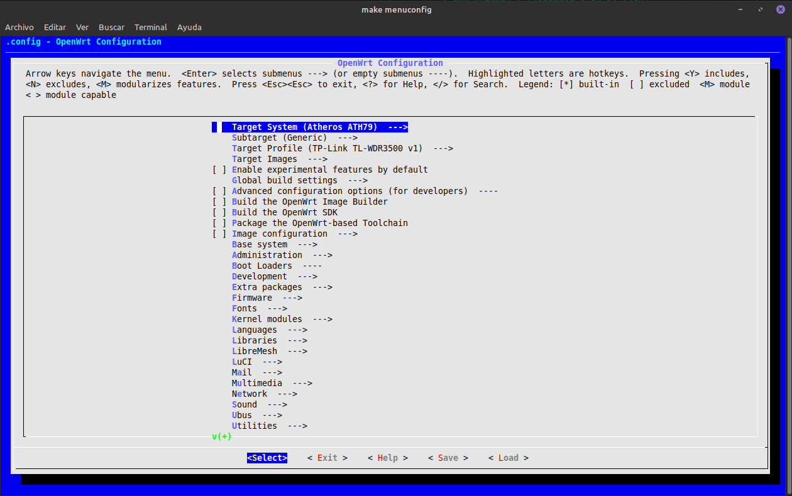

# Run OpenWRT & LibreMesh Step by Step

In this case, I'm following steps on [LibreMesh - Development](https://libremesh.org/development.html).

### Download & Compile OpenWrt Source Code

```bash
git clone -b v19.07.10 --single-branch https://git.openwrt.org/openwrt/openwrt.git
```
or
```bash
git clone --depth <last_commit_merged> https://github.com/openwrt/openwrt.git
```

Now add libremesh package in the feeds.conf.default file

```bash
# feeds.conf.default

src-git packages https://git.openwrt.org/feed/packages.git
src-git luci https://git.openwrt.org/project/luci.git
src-git routing https://git.openwrt.org/feed/routing.git
src-git telephony https://git.openwrt.org/feed/telephony.git


########## add this lines ##########
src-git libremesh https://github.com/libremesh/lime-packages.git;2024.1
src-git profiles https://github.com/libremesh/network-profiles.git
####################################


#src-git video https://github.com/openwrt/video.git
#src-git targets https://github.com/openwrt/targets.git
#src-git oldpackages http://git.openwrt.org/packages.git
#src-link custom /usr/src/openwrt/custom-feed
```

In my case, put the 2024.1 version.

### Run scripts

```bash
scripts/feeds update -a
scripts/feeds install -a
```

### Select & Deselect options in the configuration menu

```bash
make menuconfig
```
<p align="center">
  <br>
  <em>Fig. Menu config</em>
</p>

in this menu make:

_Deselect_

- Image configuration → Separate feed repositories → Enable feed libremesh
- Image configuration → Separate feed repositories → Enable feed profiles
- Base system → dnsmasq
- Network → odhcpd-ipv6only

_Select_

- LibreMesh → Offline Documentation → lime-docs-minimal
- LibreMesh → lime-app
- LibreMesh → lime-hwd-openwrt-wan 
- LibreMesh → lime-proto-anygw
- LibreMesh → lime-proto-babeld
- LibreMesh → lime-proto-batadv
- LibreMesh → shared-state
- LibreMesh →    shared-state-babeld_hosts
- LibreMesh →    shared-state-bat_hosts
- LibreMesh →  shared-state-nodes_and_links 
- Utilities → babeld-auto-gw-mode
- Network → batctl-default

Check optionals selects/deselects in the page.


### Create config-profile file
```bash
mkdir -p files/etc/config/
touch files/etc/config/lime-community
```

### Compile the images
```bash
make -j$(nproc) #or specify quantity
```

in my case, i to do nedeed run as (this flag its recommended in the make compilation)

```bash
FORCE_UNSAFE_CONFIGURE=1 make -j$(nproc)
```


