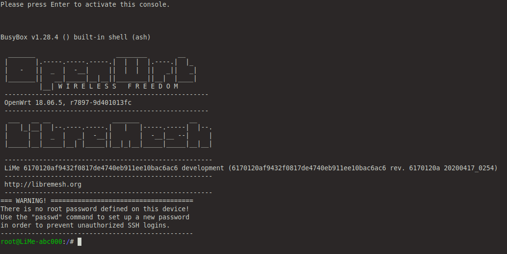

#  Mesh network with Qemu

In this file im followed the data used on [TESTING.MD]

### Get up only one node


```bash
$ sudo ./tools/qemu_dev_start  path/to/openwrt-x86-64-generic-rootfs.tar.gz path/to/openwrt-x86-64-ramfs.bzImage
```

The files can download in :
- http://repo.libremesh.org/tmp/openwrt-18.06-x86-64-generic-rootfs.tar.gz

- http://repo.libremesh.org/tmp/openwrt-18.06-x86-64-ramfs.bzImage

<p align="center">
  <br>
</p>


### Get up more nodes

To do this, use the YAML files and install _ansible_ & _clusterssh_ if necessary. 


```bash
### apt install ansible, if you don't have it already
$ cd tools/ansible/
$ sudo ansible-playbook qemu_cloud_start.yml
### use clusterssh to manage the nodes
$ sudo ansible-playbook qemu_cloud_stop.yml
```


<p align="center">
  <br>
</p>


One time upped, can connect for ssh. For example, i connect and be ping from my local host or between nodes

<p align="center">
  <br>
</p>


If exists errors with URL's, pass the path file downloaded previously in the YML file.

For example:

```yml
- name: start qemu nodes

  hosts: all
  connection: local
  gather_facts: no

  vars:
    node_id: "{{ '%02d' | format(groups['all'].index(inventory_hostname)) }}"
    lm_ifname: lm_{{ cloud }}_{{ inventory_hostname_short }}
    rootfs_url: http://repo.libremesh.org/tmp/openwrt-18.06-x86-64-generic-rootfs.tar.gz
    ramfs_url: http://repo.libremesh.org/tmp/openwrt-18.06-x86-64-ramfs.bzImage
    rootfs: /home/oem/Documentos/openwrt/qemu/rootfs.tar.gz
    ramfs: /home/oem/Documentos/openwrt/qemu/ramfs.bzImage
```