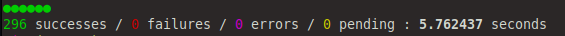

# TESTING

In this file im followed [Testing Guide - Libremesh](https://github.com/libremesh/lime-packages/blob/master/TESTING.md).

## Tools
| Tool | File | 
|--------------|--------------|
| Testing Image   | Dockerfiles/Dockerfile.unittests   |
|   Testing shell environment   | tools/dockertestshell   |
| running the tests   | ./run_tests   |

   

I needed run _docker build -f Dockerfiles/Dockerfile.unittests -t libremesh/luatest:1.2 ._  for can run the tests script.

